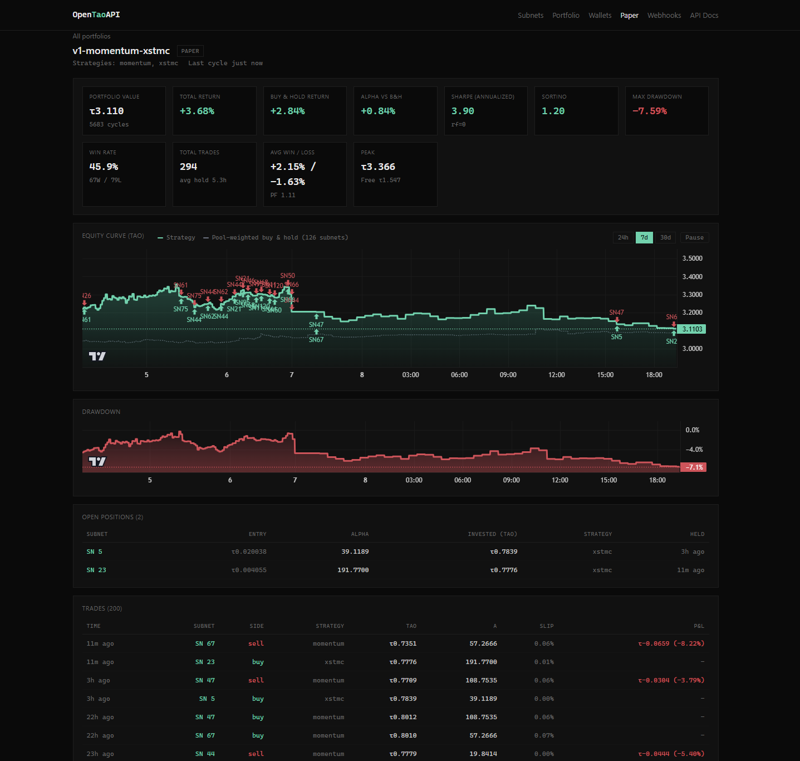
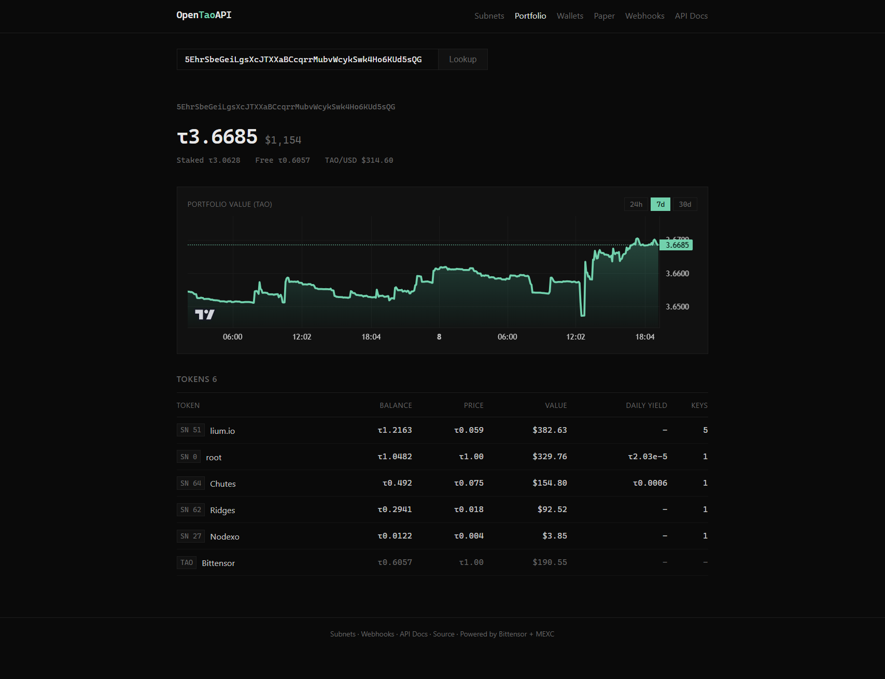
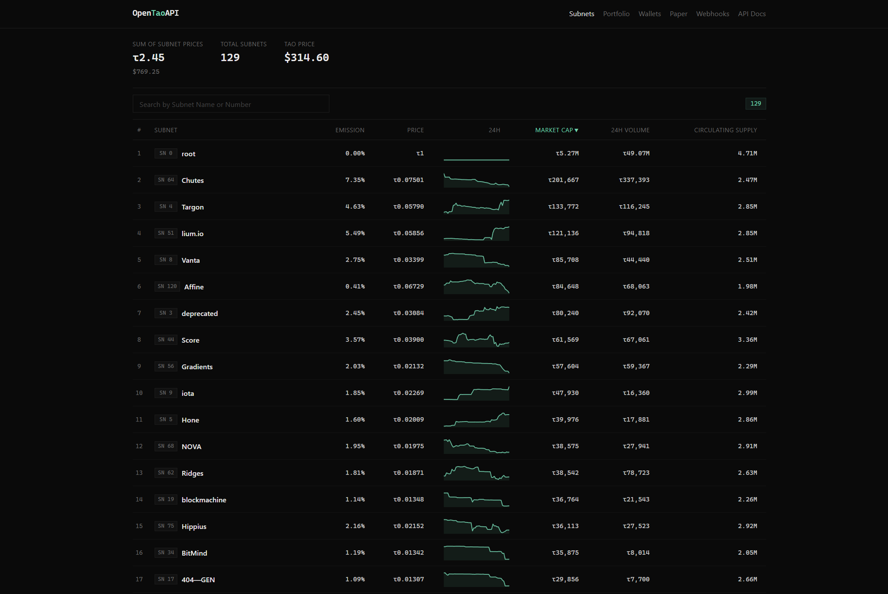

# OpenTaoAPI

A production-grade Bittensor analytics platform: REST + Server-Sent Events stream + webhooks + paper-and-live trading + AMM-aware backtester, all running off direct chain queries. Drop-in replacement for the closed-source incumbents.

**Self-hosted open-source alternative to TaoStats, TaoMarketCap, and tao.app.** Run it on your own box, own your data, pay nothing.

> Built solo by Ryan Mercier. Open to roles in Bittensor infra, crypto analytics, or trading systems. [Contact](#contact).

**Web UI** at `http://localhost:8000` &middot; **Swagger docs** at `http://localhost:8000/docs`

## Live Demo

[opentao.rpmsystems.io](https://opentao.rpmsystems.io/) &middot; running 24/7, polling chain on a 30-min cadence, no API key required.







## What's actually here

Three things that the hosted alternatives structurally cannot ship:

- **Live on-chain trading from your own keys.** A CLI runner unlocks the wallet locally, signs `add_stake` / `unstake` extrinsics, and writes trades to the same SQLite the dashboard reads. Keys never enter the FastAPI process. Same equity curve, drawdown, win rate, Sharpe whether you're paper or live.
- **Plugin strategy registry.** Drop a Python file at any path, decorate the class with `@register_strategy("name")`, point `OPENTAO_EXTERNAL_STRATEGIES` at it, and the runner picks it up alongside the four built-ins. The web "create portfolio" form lists every registered strategy automatically.
- **AMM-aware backtester.** Constant-product slippage on every trade, per-hotkey rate-limit enforcement (1 stake per 360 blocks), and zero-lookahead causal feature computation. The same engine drives paper trading; the same dashboard displays both.

## How it stacks up

| Feature | OpenTaoAPI | TaoStats | TaoMarketCap | tao.app |
|---|---|---|---|---|
| Open source | MIT | no | no | no |
| Self-hostable | yes | no | no | no |
| API key required | no | yes | yes | yes |
| Rate-limited (free tier) | none on self-host | 5 req/min | yes | yes |
| Subnet prices and market caps | yes | yes | yes | yes |
| OHLC candles | yes | no | yes | yes |
| Miner and validator tables | yes | yes | yes | yes |
| Coldkey portfolio view | yes | yes | yes | yes |
| Persistent portfolio value over time (per-wallet history) | yes | partial | partial | partial |
| Paper trading runner with plugin strategies | yes | no | no | no |
| Live on-chain execution from your own keys (CLI signs locally) | yes | no | no | no |
| Headline metrics endpoint (Sharpe, win rate, drawdown, alpha vs benchmark) | yes | partial | partial | partial |
| Backtester with AMM slippage + rate limits | yes | no | no | no |
| Full metagraph export | yes | limited | no | limited |
| Stake transfer tracking | no | yes | no | yes |
| Holder breakdowns | no | yes | yes | yes |
| Block and extrinsic data | no | yes | no | yes |
| TaoStats-compatible `/miner/` endpoint | yes | n/a | no | no |
| Webhook alerts | yes | no | no | no |
| Live event stream (SSE) | yes | no | no | no |
| Embeddable no-auth widgets | yes | no | no | no |

TaoMarketCap and tao.app are further along on breadth (stake transfers, holder analytics, block-level data). The point of OpenTaoAPI isn't to win that race; it's to be the only option you can run on your own box with webhooks, SSE, and a trading runner baked in.

## Why I built this

TaoStats and TaoMarketCap both rate-limit and require API keys. I needed reliable subnet data for a mining dashboard and trading experiments, and the hosted services either weren't fast enough on the data I cared about or charged for tier features I didn't need. The webhook, SSE, and embed primitives don't exist on the hosted side at all, so even if I paid I couldn't get them. So I built it. The trading layer came later, once I had the snapshot infrastructure stable enough to backtest against.

## Quick Start

### With conda

```bash
conda create -n tao python=3.11 -y
conda activate tao
pip install -r requirements.txt
uvicorn api.main:app --host 0.0.0.0 --port 8000
```

First startup takes ~15-20s for the initial metagraph sync. Subsequent requests are instant from cache.

### With Docker

```bash
docker-compose up -d
```

## Architecture

See [ARCHITECTURE.md](ARCHITECTURE.md) for the design decisions behind the supervisor + per-RPC timeout pattern, the snapshot broker fan-out, and on-demand backfill coalescing.

## Web UI

| Page | URL | Description |
|------|-----|-------------|
| Subnets dashboard | `/` | All subnets ranked by market cap with sparklines, live SSE-ticking prices |
| Subnet detail | `/subnet/{netuid}` | Interactive candlestick chart, miners/validators tabs, embed snippet, alert subscribe |
| Wallets | `/wallets` | Watchlist of tracked coldkeys with sparklines and last-poll age |
| Paper trading | `/paper` | Create paper portfolios, pick strategies, watch equity curve and trade markers live |
| Webhooks | `/webhooks` | Create, list, and delete webhook subscriptions |
| Portfolio | `/portfolio/{coldkey}` | Coldkey balance across all subnets, with portfolio value over time chart for tracked wallets |

The subnet detail page uses [lightweight-charts](https://github.com/tradingview/lightweight-charts) (Apache-2.0), vendored locally at `frontend/vendor/` so self-hosted installs work offline. Refresh the vendored copy with:

```bash
curl -L -o frontend/vendor/lightweight-charts.standalone.production.js \
  https://unpkg.com/lightweight-charts@4.2.3/dist/lightweight-charts.standalone.production.js
```

## Features

<details>
<summary>Full feature list (click to expand)</summary>

- REST API with full subnet, neuron, emission, and portfolio data
- TaoStats-compatible `/miner/` endpoint for drop-in replacement
- OHLC candles for every subnet (`5m`/`15m`/`1h`/`4h`/`1d`)
- Wallet watchlist with portfolio value persisted over time
- Paper trading runner with strategy plugin registry (built-in: stake_velocity, mean_reversion, momentum, drain_exit; external via `OPENTAO_EXTERNAL_STRATEGIES`)
- Live on-chain execution: same signal pipeline, real `add_stake` / `unstake` extrinsics, CLI-only with the wallet decrypted in your terminal (keys never reach the FastAPI process)
- Per-portfolio metrics: total return, vs pool-weighted buy-and-hold, alpha, Sharpe, Sortino, win rate, max drawdown, profit factor
- Backtester with constant-product AMM slippage, per-hotkey rate limits, and zero lookahead bias
- Webhook subscriptions for threshold crossings
- Server-Sent Events stream of live snapshot inserts
- Embeddable SVG sparkline widgets (no auth required)
- Web dashboard: portfolio viewer with history chart, wallet watchlist, paper-trading equity curve, subnets overview, miners/validators tables
- Direct chain queries via Bittensor SDK (no third-party APIs except MEXC for price)
- Historical data: SQLite storage with epoch-resolution snapshots via public archive node, live polling
- Backfill scripts pull directly from chain and MEXC, no third-party API keys needed
- In-memory caching with configurable TTLs, per-RPC timeouts, supervised background workers
- `/health` returns HTTP 503 when the poller is stale. Wire it directly to `docker healthcheck`, Fly, Kubernetes, etc.
- Self-hostable with Docker or conda

</details>

## API Endpoints

### Price

```
GET /api/v1/price/tao
```

Current TAO/USDT from MEXC. Cached 30s.

### Portfolio

```
GET /api/v1/portfolio/{coldkey}
GET /api/v1/portfolio/{coldkey}/history?hours=168
```

`/portfolio/{coldkey}` is the live cross-subnet portfolio: total balance (TAO + USD), free balance, staked balance, and per-subnet breakdown with alpha balance, TAO equivalent, price, daily yield.

`/portfolio/{coldkey}/history` returns a time series of total portfolio value for any coldkey on the watchlist (see Wallets below). Empty array if the coldkey isn't tracked yet. Drop into a charting library or query straight from a notebook.

### Paper and live trading

```
POST   /api/v1/paper/portfolios
GET    /api/v1/paper/portfolios
GET    /api/v1/paper/portfolios/{id}
GET    /api/v1/paper/portfolios/{id}/stats
GET    /api/v1/paper/portfolios/{id}/positions
GET    /api/v1/paper/portfolios/{id}/trades
GET    /api/v1/paper/portfolios/{id}/history
POST   /api/v1/paper/portfolios/{id}/pause
POST   /api/v1/paper/portfolios/{id}/resume
GET    /api/v1/trading/strategies
```

The same routes serve paper and live portfolios; each row carries a `mode` field of `paper` or `live`. The `/stats` endpoint returns headline metrics: portfolio value, total return, vs-benchmark return, alpha, annualized Sharpe and Sortino, max drawdown, win rate, win/loss counts, average win/loss, profit factor, average hold hours.

Create a paper portfolio, pick which registered strategies it should run, and the background runner advances it on the configured cadence using the same in-process chain client and snapshot poller. State persists to `paper_portfolios` / `paper_positions` / `paper_trades` / `paper_value_history` so a restart picks up where the previous process stopped.

```bash
curl -X POST http://localhost:8000/api/v1/paper/portfolios \
  -H 'Content-Type: application/json' \
  -d '{
    "name": "demo",
    "initial_capital_tao": 100,
    "strategies": ["mean_reversion", "momentum"],
    "poll_interval_seconds": 1800
  }'
```

The runner is gated by `PAPER_TRADING_ENABLED=true`; reads work either way so you can browse the dashboard on a public instance without running anyone's bot. `drain_exit` is always added as a safety net regardless of which entry strategies you pick.

#### Live trading (real on-chain stake/unstake)

Live trading is CLI-only. The web layer never sees your coldkey. The CLI launches a separate process that loads the wallet from `~/.bittensor/wallets/<name>/`, prompts for the password on stdin, and calls `subtensor.add_stake` / `unstake` on the same signal pipeline the paper trader uses. It writes the resulting trades into the same SQLite the web UI reads from, so the `/paper/{id}` page (with its equity curve, benchmark, and stats) just works for live portfolios too.

```bash
# 1. Create the portfolio first via the web UI or API (paper mode by default)
curl -X POST http://localhost:8000/api/v1/paper/portfolios \
  -H 'Content-Type: application/json' \
  -d '{"name": "live-demo", "initial_capital_tao": 10, "strategies": ["mean_reversion"]}'

# 2. Promote to live and start the runner.
python -m api.trading.cli live \
  --portfolio live-demo \
  --wallet my_wallet \
  --hotkey default

# Stops on Ctrl+C. Web UI shows a LIVE badge and reflects every trade.
```

Pre-flight checks fire on every trade:

- Re-fetch the pool to re-check slippage at the actual current state. If the pool moved past `max_slippage_pct` since the snapshot the strategy used, the trade is skipped.
- Coldkey free balance (with a 0.01 TAO buffer for fees).
- Kill-switch: if intraday loss reaches `daily_loss_limit_pct`, the runner sets the portfolio to inactive and refuses further entries until the operator explicitly re-enables.

Use `--dry-run` to test the pipeline against your wallet credentials without submitting any extrinsics. The trader runs the full signal loop and logs every cycle, just like a paper run, but never touches the chain.

#### Plugin strategies

The strategy registry lives at `api/trading/strategies/`. Built-ins are:

- `stake_velocity`, `mean_reversion`, `momentum`: entry strategies with different signal sources
- `drain_exit`: exit-only safety net, always active

To add your own, drop a file like this anywhere on disk and point `OPENTAO_EXTERNAL_STRATEGIES` at the directory (or single file):

```python
# /opt/my_strategies/buy_dips.py
from api.trading.models import Direction, Signal, StrategyName
from api.trading.strategies import register_strategy
from api.trading.strategies.base import Strategy

@register_strategy("buy_dips")
class BuyDipsStrategy(Strategy):
    """Buy on strong negative price momentum, hold 24h."""

    def name(self): return StrategyName.EXTERNAL

    def generate_entry_signal(self, netuid, features, snapshot):
        pm = features.price_momentum_24h
        if pm is None or pm > -0.05:
            return None
        return Signal(
            timestamp=snapshot.timestamp, netuid=netuid,
            direction=Direction.BUY, strategy=self.name(),
            strength=min(abs(pm) / 0.10, 1.0),
            reason=f"24h dip {pm*100:.1f}% on SN{netuid}",
            features=features.to_dict(),
        )

    def generate_exit_signal(self, netuid, features, snapshot, position):
        if position.hold_duration_hours(snapshot.timestamp) >= 24:
            return Signal(
                timestamp=snapshot.timestamp, netuid=netuid,
                direction=Direction.SELL, strategy=StrategyName.HOLD_TIMEOUT,
                strength=1.0, reason="24h hold", features=features.to_dict(),
            )
        return None
```

```bash
OPENTAO_EXTERNAL_STRATEGIES=/opt/my_strategies uvicorn api.main:app
```

`GET /api/v1/trading/strategies` then lists `buy_dips` alongside the built-ins with `source: external:/opt/my_strategies/buy_dips.py`. The web "Create paper portfolio" form picks it up automatically.

### Wallets (watchlist)

```
POST   /api/v1/wallets
GET    /api/v1/wallets
DELETE /api/v1/wallets/{coldkey}
```

Add a coldkey to the watchlist and the background poller refreshes it on the configured cadence (default 5 minutes), persisting one row per cycle to `wallet_portfolio_snapshots`. The portfolio page then has a real value-over-time chart instead of a single point. `POST` is idempotent: re-adding an existing coldkey reactivates polling and updates the label/interval without losing the snapshot history.

```bash
curl -X POST http://localhost:8000/api/v1/wallets \
  -H 'Content-Type: application/json' \
  -d '{
    "coldkey": "5EhrSbeGeiLgsXcJTXXaBCcqrrMubvWcykSwk4Ho6KUd5sQG",
    "label": "demo",
    "poll_interval_seconds": 300
  }'

# list watchlist with each wallet's most recent snapshot inline
curl http://localhost:8000/api/v1/wallets

# soft-delete; history is preserved, polling stops
curl -X DELETE http://localhost:8000/api/v1/wallets/5EhrSbe...
```

`poll_interval_seconds` accepts 60-86400. The poller uses the same supervised-restart pattern as the subnet poller, so a stuck RPC on one wallet doesn't block the others.

### Miner (TaoStats-compatible)

```
GET /api/v1/miner/{coldkey}/{netuid}
```

Response format matches the TaoStats `/api/miner/` endpoint. Includes coldkey balance, alpha balances across all subnets, hotkey details with emission data, and mining rank.

### Subnets

```
GET /api/v1/subnets                          # All subnets with market cap, emission %, price, volume
GET /api/v1/subnet/{netuid}/info             # Subnet hyperparams and pool data
GET /api/v1/subnet/{netuid}/neurons          # Paginated neuron list (?page=1&per_page=50)
GET /api/v1/subnet/{netuid}/metagraph        # Full metagraph (?refresh=true to bypass cache)
GET /api/v1/subnet/{netuid}/miners           # Miners with daily emission (?sort=incentive&order=desc)
GET /api/v1/subnet/{netuid}/validators       # Validators with stake, dividends, daily emission
```

### Neurons

```
GET /api/v1/neuron/{netuid}/{uid}             # Single neuron by UID
GET /api/v1/neuron/coldkey/{coldkey}          # All neurons for a coldkey
GET /api/v1/neuron/hotkey/{hotkey}            # Neuron by hotkey
```

### Emissions

```
GET /api/v1/emissions/{netuid}/{uid}
```

Emission breakdown: alpha per epoch, alpha per block, TAO per block, daily/monthly estimates in alpha, TAO, and USD.

### Historical Data

```
GET /api/v1/history/{netuid}/price?hours=720      # Alpha price history (last 30 days)
GET /api/v1/history/{netuid}/snapshots?hours=168   # Full snapshots (last 7 days)
GET /api/v1/history/{netuid}/stats                 # Data coverage stats
```

Historical data is stored in SQLite. The backfill script queries the public archive node (`wss://archive.chain.opentensor.ai`) at epoch-level resolution (~30 min intervals). The live poller adds new snapshots on a cadence controlled by `HISTORY_POLL_INTERVAL`: default 30 minutes, `-1` for every block (~12s), `0` to disable.

```bash
# Backfill last 30 days for one subnet (MEXC price fill runs automatically at the end)
python -m scripts.backfill --netuid 51 --days 30

# All subnets, last 7 days, 8 in parallel
python -m scripts.backfill --all-subnets --days 7 --concurrency 8

# From a specific block, keep TAO/USD zero (e.g. you'll fill later)
python -m scripts.backfill --netuid 51 --start-block 5000000 --skip-prices

# Resume where each subnet last stopped
python -m scripts.backfill --all-subnets --resume

# Also scrape metagraph totals (stake, emissions, neuron count, slower)
python -m scripts.backfill --netuid 51 --days 7 --full

# Re-fill tao_price_usd standalone (also runs automatically after backfill)
python -m scripts.backfill_prices
```

### OHLC candles

```
GET /api/v1/subnet/{netuid}/candles?interval=1h&hours=168
```

Returns TradingView-style `[{t, o, h, l, c, n}]`. Valid intervals: `5m`, `15m`, `1h`, `4h`, `1d`. Drop straight into [lightweight-charts](https://github.com/tradingview/lightweight-charts) or Grafana.

### Live stream

```
GET /api/v1/stream?netuid=1&netuid=64      # filter to specific subnets
GET /api/v1/stream                         # all subnets
```

Server-Sent Events. Each event is the JSON body of a freshly inserted snapshot. Heartbeat comments (`: ping`) every 15s. Works with any SSE client; try `curl -N`.

### Webhooks

```
POST   /api/v1/webhooks/subscribe
GET    /api/v1/webhooks/{id}
DELETE /api/v1/webhooks/{id}
```

Subscribe:

```bash
curl -X POST http://localhost:8000/api/v1/webhooks/subscribe \
  -H 'Content-Type: application/json' \
  -d '{
    "url": "https://your.endpoint/alerts",
    "netuid": 51,
    "metric": "alpha_price_tao",
    "direction": "cross_up",
    "threshold": 0.05
  }'
```

Metrics: `alpha_price_tao`, `tao_in`, `alpha_in`, `market_cap_tao`. Directions: `above`, `below`, `cross_up`, `cross_down`. Webhooks fire once per threshold crossing, not on every poll. **Security:** the subscribe endpoint accepts any outbound URL, so do not expose this publicly without an auth proxy in front.

### Embeddable sparkline

```
GET /embed/subnet/{netuid}/sparkline?hours=24&w=240&h=60&stroke=%2300d4aa
```

Returns an inline `image/svg+xml`. Drop into any README or landing page:

```html

```

No API key, cache-friendly (`Cache-Control: public, max-age=60`).

## Usage Examples

### curl

```bash
# TAO price
curl http://localhost:8000/api/v1/price/tao

# Portfolio for a coldkey
curl http://localhost:8000/api/v1/portfolio/5EhrSbeGeiLgsXcJTXXaBCcqrrMubvWcykSwk4Ho6KUd5sQG

# All subnets ranked by market cap
curl http://localhost:8000/api/v1/subnets

# Subnet 51 miners sorted by incentive
curl "http://localhost:8000/api/v1/subnet/51/miners?sort=incentive&order=desc"

# Subnet 51 validators sorted by stake
curl "http://localhost:8000/api/v1/subnet/51/validators?sort=stake&order=desc"

# Miner info (TaoStats-compatible format)
curl http://localhost:8000/api/v1/miner/5GEP69yPWi3qB2tLQdsbv3Fa2JA6wH6szFNP77EqXizEufvM/51

# Emission breakdown for subnet 51, UID 40
curl http://localhost:8000/api/v1/emissions/51/40

# Historical alpha price for subnet 51 (last 30 days)
curl "http://localhost:8000/api/v1/history/51/price?hours=720"

# Historical data coverage stats
curl http://localhost:8000/api/v1/history/51/stats
```

### Python

```python
import httpx

BASE = "http://localhost:8000/api/v1"

# Portfolio
r = httpx.get(f"{BASE}/portfolio/5EhrSbeGeiLgsXcJTXXaBCcqrrMubvWcykSwk4Ho6KUd5sQG")
p = r.json()
print(f"Balance: {p['total_balance_tao']:.4f} TAO (${p['total_balance_usd']:.2f})")
for sn in p["subnets"]:
    print(f"  SN{sn['netuid']} {sn['name']}: {sn['balance_tao']:.4f} TAO  yield {sn['daily_yield_tao']:.4f}/day")

# Miner data (TaoStats-compatible)
r = httpx.get(f"{BASE}/miner/5GEP69yPWi3qB2tLQdsbv3Fa2JA6wH6szFNP77EqXizEufvM/51")
data = r.json()["data"][0]
print(f"Total balance: {int(data['total_balance']) / 1e9:.4f} TAO")
for hk in data["hotkeys"]:
    print(f"  UID {hk['uid']} rank #{hk['miner_rank']} emission {int(hk['emission']) / 1e9:.4f} alpha/epoch")

# Emissions
r = httpx.get(f"{BASE}/emissions/51/40")
em = r.json()
print(f"Daily: {em['daily_tao']:.4f} TAO (${em['daily_usd']:.2f})")

# OHLC candles, drop straight into a charting library
r = httpx.get(f"{BASE}/subnet/51/candles", params={"interval": "1h", "hours": 48})
for bar in r.json()[-5:]:
    print(f"{bar['t']}  O={bar['o']:.6f}  H={bar['h']:.6f}  "
          f"L={bar['l']:.6f}  C={bar['c']:.6f}")

# Live SSE stream (one event per inserted snapshot)
with httpx.stream("GET", f"{BASE}/stream", params={"netuid": 51}, timeout=None) as s:
    for line in s.iter_lines():
        if line.startswith("data: "):
            event = __import__("json").loads(line[6:])
            print(event["netuid"], event["alpha_price_tao"])

# Subscribe a webhook for a price cross
r = httpx.post(f"{BASE}/webhooks/subscribe", json={
    "url": "https://your.endpoint/alerts",
    "netuid": 51,
    "metric": "alpha_price_tao",
    "direction": "cross_up",
    "threshold": 0.05,
})
print("Subscription:", r.json()["id"])
```

## Configuration

All settings via environment variables (or `.env` file):

| Variable | Default | Description |
|---|---|---|
| `BITTENSOR_NETWORK` | `finney` | Network: finney, testnet, local |
| `SUBTENSOR_ENDPOINT` | _(empty)_ | Custom subtensor websocket URL (e.g. `ws://localhost:9944`). Overrides `BITTENSOR_NETWORK` when set. Use this to connect to your own node and avoid public RPC rate limits. |
| `CACHE_TTL_METAGRAPH` | `300` | Metagraph cache seconds |
| `CACHE_TTL_PRICE` | `30` | Price cache seconds |
| `CACHE_TTL_DYNAMIC_INFO` | `120` | Subnet pool data cache seconds |
| `CACHE_TTL_BALANCE` | `60` | Balance/stake cache seconds |
| `RPC_TIMEOUT` | `20.0` | Per-RPC timeout (seconds). Prevents a single slow chain call from blocking the whole poll cycle. |
| `ARCHIVE_ENDPOINT` | `wss://archive.chain.opentensor.ai:443/` | Archive node for historical backfill |
| `DATABASE_PATH` | `data/opentao.db` | SQLite database path for historical data |
| `HISTORY_POLL_INTERVAL` | `1800` | Seconds between live snapshots. `0` disables polling; `-1` polls every block (~12 s). |
| `HISTORY_POLL_NETUIDS` | _(empty)_ | Comma-separated netuids to poll (empty = all active) |
| `API_HOST` | `0.0.0.0` | Bind address |
| `API_PORT` | `8000` | Port |
| `PAPER_TRADING_ENABLED` | `false` | Run paper-trading cycles for active portfolios. Read-only API works regardless. |
| `OPENTAO_EXTERNAL_STRATEGIES` | _(empty)_ | Colon-separated paths to user strategy files/directories. Loaded into the registry on startup. |

## Project Structure

```
OpenTaoAPI/
├── api/
│   ├── main.py                 # FastAPI app, lifespan, poller + evaluator supervisors
│   ├── config.py               # Settings from environment
│   ├── routes/
│   │   ├── price.py            # TAO price from MEXC
│   │   ├── miner.py            # TaoStats-compatible miner endpoint
│   │   ├── neuron.py           # Neuron lookup by UID/hotkey/coldkey
│   │   ├── subnet.py           # Subnet info, metagraph, miners, validators, /subnets
│   │   ├── emissions.py        # Emission breakdown
│   │   ├── portfolio.py        # Cross-subnet portfolio + history endpoint
│   │   ├── wallets.py          # Watchlist CRUD (add/list/remove tracked coldkeys)
│   │   ├── paper.py            # Paper portfolio CRUD, positions, trades, history, strategy registry
│   │   ├── history.py          # Historical snapshots + OHLC candles
│   │   ├── stream.py           # Server-Sent Events live feed
│   │   ├── webhooks.py         # Threshold-crossing webhook subscriptions
│   │   └── embed.py            # Embeddable SVG sparkline widget
│   ├── services/
│   │   ├── chain_client.py     # Bittensor SDK wrapper with per-RPC timeouts
│   │   ├── price_client.py     # MEXC live price + historical klines
│   │   ├── cache.py            # In-memory TTL cache
│   │   ├── database.py         # SQLite storage (snapshots, webhooks, watchlist, paper trading)
│   │   ├── broker.py           # Fan-out broker for live snapshot events
│   │   ├── portfolio_service.py # Shared portfolio compute (route + wallet poller)
│   │   ├── metagraph_compat.py # SDK version compatibility layer
│   │   └── calculations.py     # Emission math
│   ├── trading/                # Paper trading + backtester package
│   │   ├── config.py           # TradingConfig dataclass
│   │   ├── models.py           # Snapshot, Features, Signal, Trade, Position, PortfolioState
│   │   ├── amm.py              # Constant-product AMM math, slippage, position sizing
│   │   ├── features.py         # Causal feature engine (z-score, momentum, velocity)
│   │   ├── risk.py             # Position-sizing risk manager
│   │   ├── portfolio.py        # PortfolioTracker (in-memory, SQLite-backed)
│   │   ├── paper_trader.py     # In-process paper trading runner
│   │   ├── live_trader.py      # Live on-chain trader (extends PaperTrader, signs extrinsics)
│   │   ├── backtester.py       # Historical replay with rate limits and slippage
│   │   ├── data.py             # Read-only DataLoader over subnet_snapshots
│   │   ├── cli.py              # python -m api.trading.cli ...
│   │   └── strategies/         # Strategy plugin package
│   │       ├── base.py         # Strategy ABC
│   │       ├── stake_velocity.py, mean_reversion.py, momentum.py, drain_detector.py
│   │       └── __init__.py     # Registry, decorator, external loader
│   └── models/
│       └── schemas.py          # Pydantic response models
├── scripts/
│   ├── backfill.py             # Historical chain scraper (parallel, resumable)
│   └── backfill_prices.py      # MEXC kline backfill for tao_price_usd
├── data/
│   └── opentao.db              # SQLite database (created on first run)
├── frontend/
│   ├── common.css              # Shared styles
│   ├── subnets.html            # Subnets dashboard (landing page)
│   ├── subnet-detail.html      # Per-subnet view: chart, miners, validators, embed
│   ├── webhooks.html           # Webhook management UI
│   ├── wallets.html            # Watchlist UI (/wallets)
│   ├── index.html              # Portfolio page (/portfolio) with value-over-time chart
│   └── vendor/
│       └── lightweight-charts.standalone.production.js  # TradingView charts, Apache-2.0
├── docs/
│   ├── deploy-fly.md           # Fly.io deployment guide
│   └── images/                 # README screenshots
├── ARCHITECTURE.md
├── SUPPORT.md
├── docker-compose.yml
├── Dockerfile
├── requirements.txt
├── .env.example
├── .gitignore
└── LICENSE
```

## How It Works

**Data sources:**
- Bittensor chain via `AsyncSubtensor` for metagraph, balances, stake info, subnet data
- MEXC public API for TAO/USDT price (no auth required, 500 req/10s limit)

**Emission calculation:**
```
alpha_per_day = meta.E[uid] / tempo * 7200
tao_per_day   = alpha_per_day * (pool.tao_in / pool.alpha_in)
usd_per_day   = tao_per_day * tao_price
```

Where `meta.E[uid]` is alpha per epoch, `tempo` is blocks per epoch (usually 360), and `7200` is blocks per day.

**Validator yield** is proportional to stake share: `yield = emission * (my_stake / total_stake_on_hotkey)`.

**Caching:** metagraph syncs are expensive (~10-20s cold). All queries are cached in-memory with configurable TTLs. Use `?refresh=true` on metagraph endpoints to force a fresh sync.

## Deployment

`docker compose up -d` or the conda path in [Quick Start](#quick-start) gets you a local instance in under a minute. For Fly.io specifically, see [docs/deploy-fly.md](docs/deploy-fly.md).

## Contact

Built by Ryan Mercier ([github.com/ryanmercier](https://github.com/ryanmercier)). Open to roles in Bittensor infrastructure, analytics, or trading systems. Issues and PRs welcome, or reach out directly.

Donations: see [SUPPORT.md](SUPPORT.md).

## License

MIT
